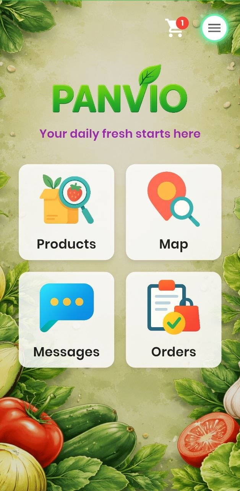
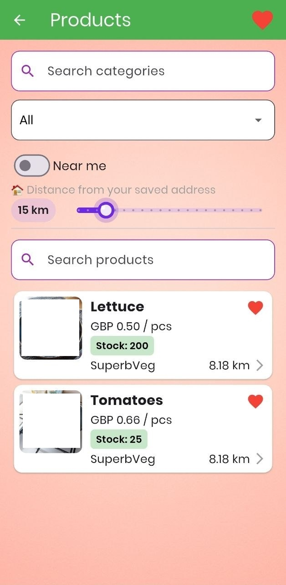
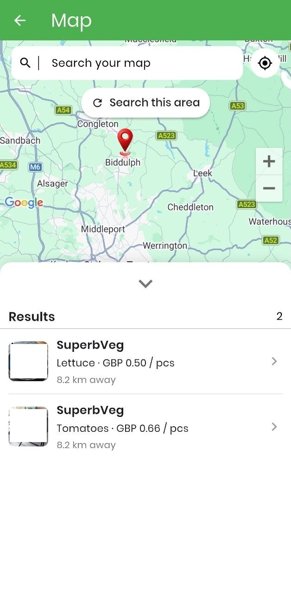
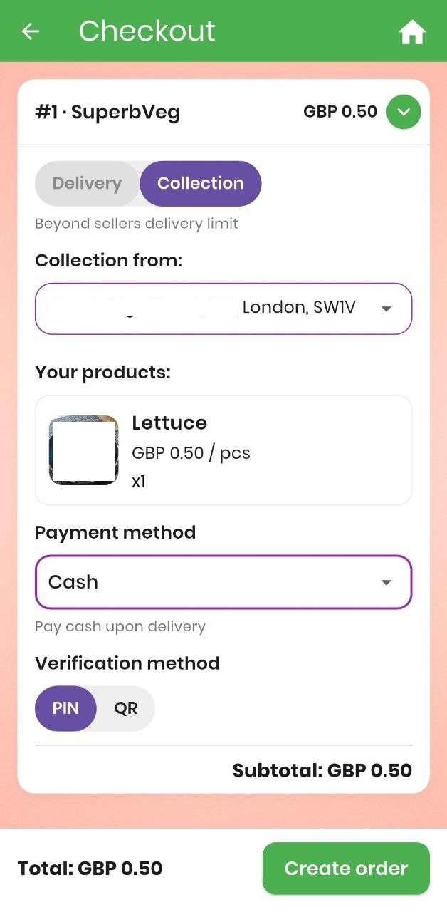
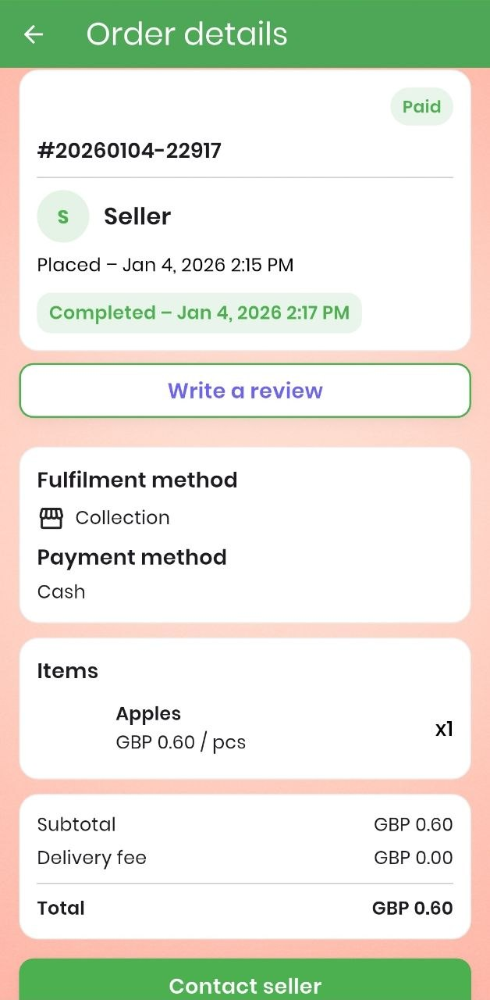

# Panvio – Fresh Food Marketplace App

Panvio is a real-world marketplace app for buying and selling fresh food locally, people-to-people.

It allows users to discover nearby sellers, place orders, communicate directly, and verify transactions using QR codes — all in one platform.

---

## 🚀 Key Features

- Product search for local buyers
- Map search for products and sellers  
- Ordering system  
- Real-time messaging between users  
- QR code verification  
- Multilingual support  
- Basic analytics
- User authentication
- Buyer/Seller accounts
- Seller subscription

---

## 🛠️ Tech Stack

- Flutter / Dart (mobile app)
- Backend: Firebase
- Database: Cloud Firestore

---

## 📸 Screenshots

### Home / Map

### Product Listing

### Messaging

### Map search

### Basket

### Orders

---

## 👨‍💻 My Role

- Designed and built the application from scratch  
- Developed core features including search, messaging and order system  
- Implemented QR-based verification flow  
- Focused on usability and real-world functionality

---

## 💡 About This Project

This is a real application developed and currently in production.  
This repository is a showcase of the project. The full source code is private.

---
